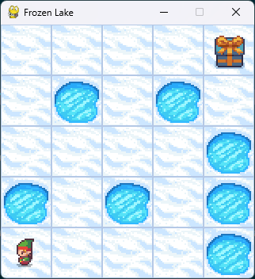

<!DOCTYPE html>
<html lang="en">
<head>
  <link rel= "Styles" href="Styles.css">
</head>
<body>
    <header>
        <h1>FrozenLake Gymnasium Environment</h1>
    </header>
    <main>
        

          
        

        

          The Frozen Lake problem in the OpenAI Gym environment is a classic reinforcement learning challenge where an agent learns to navigate a grid-like world. The environment is presented as a grid of blocks, where each block can be one of four types:
        

        <ul>
            <li>S (Start): The starting point of the agent.</li>
            <li>F (Frozen): Safe blocks that the agent can step on.</li>
            <li>H (Hole): Dangerous blocks that the agent should avoid, as stepping on them would result in the game ending unsuccessfully.</li>
            <li>G (Goal): The destination block that the agent is trying to reach.</li>
        </ul>
        

          The goal is for the agent to learn a policy to move from the start to the goal, stepping only on the frozen blocks while avoiding the holes. The floor might be slippery, which means the agent might not always move in the intended direction.
        

        
To execute the scripts, simply open them in your preferred Integrated Development Environment (IDE) and click the 'Run' button. There are no additional setup steps required. However, please note that the hyperparameter version generates a large number of images.

        

          The maps.py file contains various grid sizes for the environment, ranging from 4x4 to 12x12, with increasing complexity. For example, a 4x4 grid is represented as follows:
        

        

          "FFFG", 
          "FHFH", 
          "FFFH", 
          "SFFH"
        

        

          The Python scripts use a Q-learning algorithm to train a agent on maps. It defines a Q-table to keep track of the value of taking a certain action in a particular state. another Approuch script "Assignmnet2_38336529_FrozenLake_Hyper" includes hyperparameters such as learning rate, discount factor, and epsilon decay rate to adjust the balance between exploration (trying out new actions) and exploitation (using known information to maximize the reward). Over time, the agent explores less and relies more on the learned values in the Q-table.
        

        

          The agent's interactions with the environment, along with its rewards, are graphed to illustrate the learning progress over time.
        

        <h2>Key parameters used for customization</h2>
        <ul>
          <li>map_objects: maps["5x5"] the "5x5" can be any map in the maps.py file (You can add your own)</li>
          <li>Learning_rate: you can change the Learning_rate but must be --> (0 < α <= 1)</li>
          <li>discount_factor: Usualy 1 but you can change it </li>
          <li>epsilon_decay: Usualy a small value but you can change it</li>
          <li>is_slippery: A boolean value that creates randomness in the environment</li>
          <li>render_mode: Set value to 'human' for GUI otherwise keep at None for faster training</li>
        </ul>
    </main>
    <footer>
        
&copy; 2024 Dewald Oosthuizen (38336529)

    </footer>
</body>
</html>
